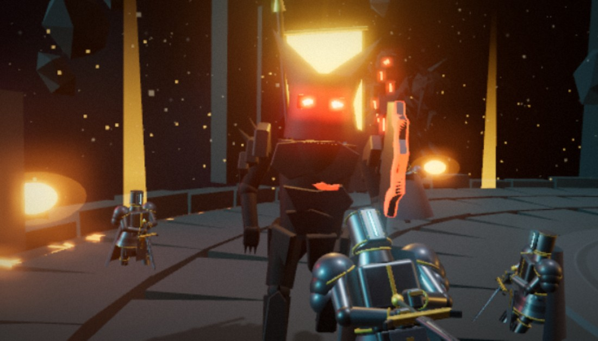
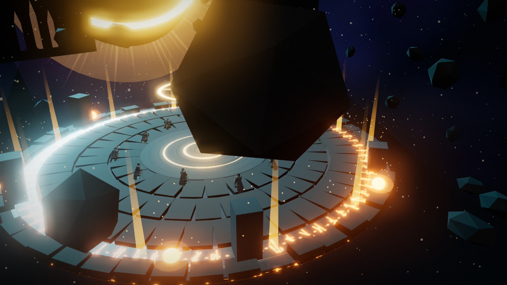
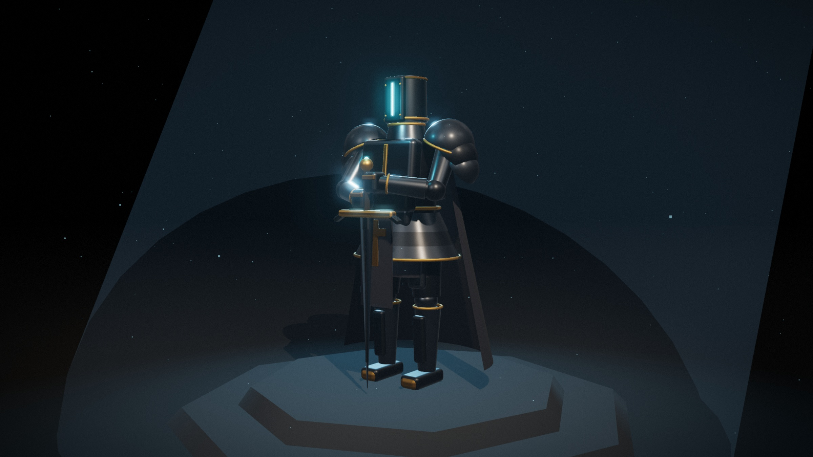

# ⚔️ BladeFront — Arena del Vacío

Un CTF de 12 jugadores construido enteramente sobre **three.js**: sin modelos
importados, sin texturas, sin pistas de audio. La armadura de cada caballero,
la isla flotante, las animaciones y hasta la banda sonora salen de código —
geometría generada en tiempo de ejecución y **Web Audio API** para el sonido.

> Alguien agarra el Ciber-Estandarte del centro y se corrompe al instante en
> el **Ejecutor del Vacío**, un jefe monstruoso. Los otros once tienen que
> derribarlo a placajes antes de que acumule **45 s de Dominio** — si lo
> logra, gana la ronda. Todo pasa sobre una isla flotando en un abismo, así
> que perder el equilibrio también cuenta como perder.

Ese es el **Modo Juggernaut**, el juego original. Con el mismo motor y los
mismos assets corre además **Captura la Bandera**, que juega en red contra los
equipos del resto del curso hablando un protocolo binario propio, diseñado
entre todos — misma arena, mismos caballeros, reglas distintas.

Proyecto para **Computer Science 8 — Proyecto 1 (Juego)**.

<p align="center">
  
</p>
<p align="center">
  
  
</p>

## Jugarlo

Hay dos juegos aquí. El **Modo Juggernaut** es el original: arena flotante,
placajes y un jefe. **Captura la Bandera** es el que habla el protocolo
propio del curso, diseñado entre todos los equipos, y con el que se juega entre
computadoras distintas.

Los roles están separados para que la computadora que aloja la partida no
participe como jugador. El comando normal abre primero una pantalla para elegir:

```bash
npm start        # elegir Servidor o Cliente en el navegador
npm run server   # acceso directo al modo Servidor
npm run client   # acceso directo al modo Cliente
```

El servidor muestra a todos los jugadores y la bandera, pero no acepta
controles de movimiento, no ocupa un cupo y solo consulta su estado por
`127.0.0.1`. Desde esa pantalla se inicia la cuenta atrás cuando los clientes
ya entraron. El cliente no levanta un servidor propio. Tanto el servidor como
el cliente incluyen **Cambiar configuración**, que cierra el rol activo, libera
sus puertos y vuelve a la selección inicial. O a mano:

```bash
npx http-server . -p 8145 -c-1
```

- Modo Juggernaut → `http://localhost:8145/assets/modo-juggernaut/`
- Captura la Bandera → `http://localhost:8145/assets/captura-v3/`
- Vista del servidor → `http://localhost:8145/assets/captura-v3/servidor.html`

**Modo Juggernaut**

| Tecla | Acción |
|---|---|
| `WASD` | Moverse (relativo a cámara) |
| `Espacio` / `F` | Placaje — o **Ground Slam** si eres el Juggernaut |
| `Shift` / `Q` | Esquiva (voltereta o deslizamiento) |
| `C` | Ceder / retomar el control (IA ↔ humano) |
| `M` | Silenciar la música |
| `P` | Pausa · `R` reinicia tras la victoria |

**Captura la Bandera**

| Tecla | Acción |
|---|---|
| `WASD` / flechas | Moverse, relativo a la cámara |
| `E` / `Espacio` | Tomar la bandera o robarla — se puede dejar pulsado |
| `M` | Vista 2D cruda, para depurar |
| Ratón | Orbitar la cámara |

Se gana sacando la bandera del círculo dorado del centro. No hay diagonales:
el protocolo solo admite cuatro direcciones, así que se avanza en zigzag.

## Cómo está armado

```
assets/
  caballero-templario/   El personaje: malla + rig + animador
    js/knight.js            createKnight() — geometría procedural con pivotes
    js/knight-anim.js       KnightAnimator — marcha, 5 idles, 3 placajes, esquivas…
  arena-vacio/            El escenario
    js/arena.js              createArena() — isla flotante con runas
    js/cosmos.js             createCosmos() — monolitos, Eclipse, niebla en GPU
    js/titans.js             Guerra de titanes de fondo (Arconte vs. Behemoth)
    js/monumentos.js         Los Doce Testigos — estatuas de mármol procedurales
  ejecutor-del-vacio/     El jefe
    js/executor.js           createExecutor() — verdugo corrupto (vértices a mano)
    js/enemy-system.js       EnemySystem — steering, colisión, knockback
  modo-juggernaut/        Donde todo se junta
    js/juggernaut-mode.js    Reglas, estados, física, bus de eventos
    js/flag.js               Ciber-Estandarte (onda de vértices)
    js/audio.js              VoidScore — música y SFX procedurales
    js/main.js               Escena, input, cámara, HUD, efectos
  captura-v3/             Captura la Bandera — el juego en red
    js/motor-v3.js           Reglas puras: ciclo del servidor, sin three.js
    js/visor-v3.js           Render 3D, reutiliza arena, caballeros y cosmos
    js/visor-2d.js           Vista cenital cruda, para depurar
    js/cliente-v3.js         Misma superficie en modo local y en red
    js/bots-v3.js            Rivales para el modo local
red/v3/                   El protocolo, compartido por servidor y navegador
    protocolo-v3.js          Códec binario y reensamblado de mensajes TCP
    servidor-v3.js           Servidor autoritativo
    bridge-v3.js             Traductor WebSocket ↔ TCP para el navegador
    descubrimiento.js        Anuncio y búsqueda de servidores por UDP
    reloj.js                 Reloj de ciclo que corrige la deriva del sistema
iniciar.js / iniciar.bat  Lanzador de un clic: servidor + bridge + web
test/                     Pruebas de regresión (node test/verify-*.mjs)
```

Cada carpeta de `assets/` funciona también sola, como visor con botón de
captura PNG (`/caballero-templario/`, `/arena-vacio/`, `/ejecutor-del-vacio/`).

## Por qué está organizado así

Cada pieza exporta un `createX()` que devuelve un `THREE.Group` — nada vive
atado a una escena en particular, así que se pueden mezclar libremente (el
Ejecutor camina sobre la Arena, el Caballero se reutiliza como los 11
cazadores, etc). Las reglas del juego tampoco tocan el DOM ni dependen de
three.js directamente: viven en clases planas que reciben posiciones y
devuelven física, lo que deja la puerta abierta a correr la misma simulación
en un servidor Node sin reescribir nada. Los eventos importantes de una
partida (captura, derribo, slam, caída) pasan por un `EventTarget` compartido
— ahí es donde se engancha el HUD, el audio, y donde se enganchará la red.

Sin paso de build: todo carga por `<script type="module">` + importmap
apuntando a un CDN. Se abre el HTML y ya está corriendo.

## Multijugador

Un jugador por computadora, hablando el **PRFC-CC8-2026 v3**: un protocolo
**propio**, escrito desde cero y negociado entre los equipos del curso. No hay
ningún estándar de terceros de por medio — el formato de los mensajes, el orden
del ciclo y las reglas del juego se discutieron y acordaron en clase. La gracia
está en que el servidor de cualquier grupo funcione con el cliente de cualquier
otro, aunque uno esté escrito en C# y el otro en JavaScript.

Va en binario sobre TCP, con un prefijo de longitud por mensaje y las
coordenadas como enteros ×100 para que ningún lenguaje redondee distinto. Los
servidores se anuncian por UDP, así que no hay que ir preguntando direcciones.

Las partidas entre equipos se juegan sobre **Radmin VPN**, que mete a todo el
mundo en la misma red virtual (rango `26.x.x.x`).

```bash
node red/v3/servidor-v3.js --auto     # la partida
node red/v3/bridge-v3.js              # solo si vas a jugar desde el navegador
```

El bridge existe porque el navegador no puede abrir un socket TCP ni mandar un
datagrama UDP. Traduce las dos cosas sin tocar un solo byte del protocolo: por
el cable viaja exactamente lo que espera cualquier otro equipo.

**Verificación.** El protocolo trae una prueba de compatibilidad —un `INPUT`
concreto que debe dar los bytes `11 03 00 07 01`— y sobre eso montamos el
resto. Son 390 comprobaciones que van desde esos bytes sueltos hasta partidas
completas jugadas por sockets reales:

```bash
node test/verify-protocolo-v3.mjs    # códec binario y fragmentación TCP
node test/verify-motor-v3.mjs        # reglas del juego
node test/verify-servidor-v3.mjs     # partida completa sobre TCP
node test/verify-bots-v3.mjs         # y el hallazgo de abajo
```

**Un problema del protocolo que encontramos midiendo.** Tal como está escrito,
robar la bandera es instantáneo, los jugadores no colisionan y todos van a la
misma velocidad. Se puede jugar y se puede ganar, pero cuando dos llegan juntos
al borde la bandera les cambia de manos *en cada ciclo* —47 robos en 47 ciclos
en el duelo de prueba— y acaba ganando quien la tenga en el ciclo exacto del
cruce. Arrancar un solo paso más atrás le da la victoria al otro sin que
ninguno juegue distinto. El detalle, con las mediciones, está en
[`docs/observaciones-prfc-v3.md`](docs/observaciones-prfc-v3.md).

Nuestro servidor se mantiene fiel a la especificación mientras el equipo no la
enmiende. El modo local sí trae inmunidad, o no se podría jugar.

## Licencia

MIT — ver [`LICENSE`](LICENSE).
