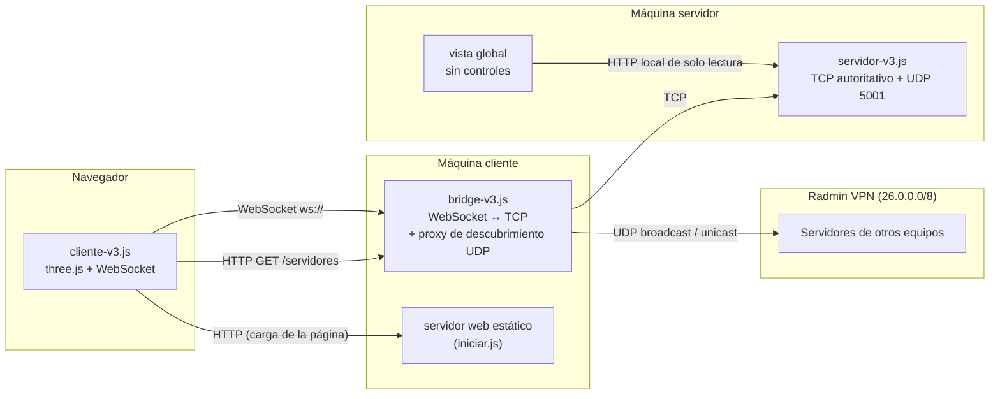

# Manual de la conexión de red — BladeFront (Captura la Bandera)

Este documento explica cómo funciona la capa de red del proyecto, para poder
explicársela al profesor de Computer Science 8 sin tener que improvisar. Todo
lo que se describe aquí está sacado directamente del código en
`red/v3/` y `assets/captura-v3/js/cliente-v3.js`; no hay nada inventado ni
simplificado más allá de lo necesario para explicarlo en voz alta.

El contexto del proyecto: cada equipo de la clase implementa su propio
cliente y servidor siguiendo un protocolo compartido, el **PRFC v3**
(Protocolo de Red para Captura la Bandera, versión 3). Luego todos los
equipos juegan entre sí conectados por **Radmin VPN**, una VPN de red virtual
que simula estar todos en la misma LAN aunque cada quien esté en su casa.

---

## 1. Arquitectura general: procesos según el rol

`iniciar.js` siempre levanta el servidor web estático, pero los procesos de
red dependen de la configuración elegida:

1. **Rol servidor:** levanta el servidor TCP autoritativo
   (`red/v3/servidor-v3.js`), el respondedor UDP y la vista global. No levanta
   un cliente jugable.
2. **Rol cliente:** levanta el bridge WebSocket↔TCP
   (`red/v3/bridge-v3.js`) y el navegador jugable. No aloja una partida.
3. **Servidor web estático:** sirve los archivos HTML/JS/Three.js en ambos
   roles y vive dentro de `iniciar.js`.

### Por qué hace falta el bridge

La pieza que sorprende a quien no ha tocado programación de redes en el
navegador es la número 2. La razón es una limitación real de la plataforma
web, no una elección de diseño:

- **Un navegador no puede abrir un socket TCP crudo.** JavaScript en el
  navegador solo tiene `fetch`/HTTP y `WebSocket` como transportes de red.
  No existe una API `net.Socket` como la de Node disponible en el navegador.
- **Un navegador tampoco puede mandar datagramas UDP.** El descubrimiento de
  servidores (ver sección 4) depende de UDP broadcast, y eso tampoco está
  disponible desde JavaScript de página web.

El servidor autoritativo, en cambio, SÍ habla TCP puro (así lo pide el PRFC
v3, para que todos los equipos —sea cual sea su lenguaje— puedan
interoperar con un socket estándar). Entonces hace falta algo en el medio que
el navegador sí pueda usar (WebSocket) y que hable TCP del otro lado. Eso es
exactamente el bridge.

```
              WebSocket (navegador)         TCP (protocolo del juego)
Navegador  ───────────────────────▶  BRIDGE  ───────────────────────▶  Servidor
(cliente-v3.js)                    (bridge-v3.js)                  (servidor-v3.js)


              HTTP GET /servidores          UDP broadcast / unicast
Navegador  ───────────────────────▶  BRIDGE  ───────────────────────▶  Red local / VPN
                                    (hace de proxy porque el
                                     navegador no puede UDP)
```

En forma de diagrama de procesos:



Nótese que el bridge cumple **dos** papeles a la vez: traduce la conexión de
juego (WebSocket↔TCP) y hace de proxy del descubrimiento UDP (el navegador le
pide por HTTP `/servidores` y el bridge sale a la red por él). Los dos
existen por el mismo motivo: el navegador no tiene acceso a sockets crudos.

La separación impide que la computadora configurada como servidor participe
accidentalmente como jugador. `iniciar.js` coordina el conjunto que corresponde
a cada rol (ver sección 6).

---

## 2. El protocolo: PRFC v3

El códec vive en `red/v3/protocolo-v3.js` y lo comparten literalmente los
tres procesos —servidor, bridge (indirectamente) y cliente— porque es el
mismo archivo JavaScript, sin build step, importado con rutas relativas tanto
en Node como en el navegador.

Puntos clave:

- **Mensajes binarios**, no JSON. Cada mensaje empieza con un byte de tipo
  (`0x10` = JOIN, `0x25` = GAME_STATE, etc.) y un byte de versión de
  protocolo.
- **Framing con prefijo de longitud sobre TCP**: cada mensaje va precedido de
  un entero `u16` **big-endian** con el número de bytes que le siguen. Esto
  es obligatorio porque TCP es un flujo de bytes, no una secuencia de
  mensajes: un solo `read()` puede traer medio mensaje, dos mensajes
  pegados, o dos bytes y medio de un tercero. Sin ese prefijo no habría forma
  de saber dónde termina un mensaje y empieza el siguiente. Quien resuelve
  esto en el código es la clase `AcumuladorTCP`: acumula bytes hasta tener
  el prefijo completo, luego hasta tener el cuerpo completo, y solo entonces
  entrega el mensaje decodificado. Se usa igual en el servidor y en el
  cliente.
- **UDP no lleva ese prefijo**: el datagrama completo ES el mensaje (así lo
  exige el protocolo, porque UDP ya entrega datagramas discretos, no un
  flujo).
- **Enteros multi-byte en big-endian.** Es una convención de bytes: el byte
  más significativo va primero. Hay que respetarla al pie de la letra para
  que un servidor en Java o C# lea los mismos números que uno en JavaScript.
- **Coordenadas como enteros ×100.** El juego trabaja internamente con
  flotantes (posiciones en el plano), pero el protocolo transporta enteros
  para evitar ambigüedades de precisión entre lenguajes distintos. Las
  funciones `esc()`/`desesc()` son el único lugar del código donde se cruza
  esa frontera flotante↔entero; mezclar un valor escalado con uno sin escalar
  produce distancias 100 veces erróneas (es un error real que se dio durante
  el desarrollo, documentado en el propio código como "la trampa 2").

### Por qué el bridge NO decodifica nada

Esto es importante y es una decisión deliberada, no un descuido: el bridge
reenvía los bytes tal cual, en ambas direcciones, sin tocar ni un byte del
tramo de juego (`tcp.on('data', d => ws.send(d))` y viceversa). Nunca llama a
`decodificar()` ni a `codificar()` sobre esos mensajes.

Las razones:

1. **Desacoplamiento de versión.** Si el bridge tuviera que entender el
   protocolo, habría que actualizarlo cada vez que cambiara el PRFC, y
   correría el riesgo de desincronizarse del servidor (que sí lo entiende
   bien) o del cliente. Como tubería tonta, cualquier cambio futuro del
   protocolo lo atraviesa sin tocar el bridge para nada.
2. **Menos superficie de error.** Un bridge que reenvía bytes no puede
   corromper un mensaje al reinterpretarlo mal.
3. **El reensamblado de mensajes lo hace el cliente**, con su propia
   instancia de `AcumuladorTCP` — el bridge no necesita saber dónde empieza
   o termina cada mensaje para poder reenviarlo.

En otras palabras: el bridge es una tubería a nivel de bytes, y el
entendimiento del protocolo vive únicamente en los dos extremos (servidor y
cliente), que son quienes de verdad necesitan interpretarlo.

---

## 3. Cómo se decide quién es el anfitrión

El PRFC v3 no dice explícitamente qué mecanismo usar para elegir quién
controla el inicio. En el modo actual, la máquina servidor no crea jugador:
el **primer cliente aceptado** se convierte en anfitrión jugable.

Puntos importantes de esta regla:

- El servidor no ocupa un `playerId` y nunca envía `INPUT` o `INTERACT`.
- Solo el `playerId` anunciado por `HOST_INFO` puede enviar `HOST_START`.
- Los demás clientes pueden jugar, pero no iniciar.
- La vista global conserva un botón administrativo para iniciar si fuera
  necesario, sin registrar al observador como jugador.
- Si no existe un anfitrión activo, el siguiente JOIN aceptado en estado
  `WAITING` puede ocupar el puesto.

---

## 4. Descubrimiento de servidores por UDP

Esta es la parte más rica del sistema de red, porque en la práctica no basta
con un solo mecanismo: Radmin VPN se comporta distinto de una LAN normal, y
hubo que combinar varias vías para encontrar servidores de forma confiable.
Todo esto vive en `red/v3/descubrimiento.js`.

El mensaje base es simple: el cliente manda `DISCOVER_REQUEST` (tipo
`0x01`) y cualquier servidor que lo reciba contesta con `DISCOVER_RESPONSE`
(tipo `0x02`) directamente a quien preguntó. La IP del servidor **no viaja
dentro del mensaje**: se toma del origen real del datagrama UDP, para que no
se puedan anunciar direcciones falsas o equivocadas por tener varias
interfaces de red.

### 4.1 Broadcast estándar (`255.255.255.255`)

Es la vía de libro de texto: un cliente manda el `DISCOVER_REQUEST` a la
dirección de broadcast limitado y espera respuestas. **El problema**: un
socket UDP sin atar a una interfaz concreta sale por la que decida la tabla
de rutas del sistema operativo — típicamente la Wi-Fi o el Ethernet físico —
y **nunca entra en el adaptador virtual de Radmin**. Sobre una VPN como esta,
el broadcast estándar por sí solo casi nunca encuentra a nadie fuera de la
propia máquina.

### 4.2 Difusión dirigida por interfaz

La solución real: atar explícitamente un socket **a la dirección de cada
interfaz de red** de la máquina, y desde cada uno mandar a la **difusión
dirigida de esa interfaz concreta** (`ip | ~máscara`). Para el adaptador de
Radmin, con máscara `255.0.0.0` (una /8), eso da exactamente
`26.255.255.255`: la dirección de difusión de toda la red virtual de Radmin.

```js
// direccionDeDifusion: 26.11.206.94 con máscara 255.0.0.0 → 26.255.255.255
export function direccionDeDifusion(ip, mascara) {
  return aTexto(((aNumero(ip) | (~aNumero(mascara) >>> 0)) >>> 0));
}
```

Esto es lo que de verdad alcanza a los compañeros de Radmin sin tener que
enumerar direcciones una por una, porque en la práctica los compañeros del
curso están repartidos por **todo** el rango `26.0.0.0/8`, no dentro de un
mismo `/24`. La función `difundirPorInterfaces()` hace esto para cada
interfaz en paralelo, con su propio socket y su propio manejo de errores, así
que si la Wi-Fi no admite difusión eso no le impide a la interfaz de Radmin
hacer su trabajo.

### 4.3 Sondeo directo (unicast) a compañeros conocidos

Como plan B, cuando ni siquiera la difusión dirigida atraviesa el adaptador
virtual (algunos drivers de Radmin la descartan según el equipo), existe
`sondearDirecciones()`: el mismo `DISCOVER_REQUEST`, pero mandado **uno a
uno por unicast** a una lista de direcciones IP conocidas. Un unicast no
depende de que la VPN reenvíe broadcasts — viaja como cualquier paquete
normal de la red, así que llega siempre que el compañero esté encendido y
conectado.

Esa lista de "compañeros conocidos" es el roster `NOMBRES_RADMIN` de
`red/v3/vecinos.js`: un mapa a mano de IP → nombre de cada integrante del
curso en la VPN de Radmin. Se sondea a todos ellos automáticamente en cada
búsqueda, sin que el usuario tenga que escribir nada.

### 4.4 Detección de vecinos vía tabla ARP

Una tercera fuente de candidatos, complementaria a las anteriores:
`vecinosVivos()` en `vecinos.js` lee la tabla de vecinos del propio sistema
operativo (`arp -a` en Windows, o `ip neigh` en Linux). La idea es
aprovechar algo que el sistema ya hizo por su cuenta: cuando dos equipos
intercambian cualquier paquete por la VPN, el sistema operativo apunta al
otro en su tabla de vecinos con su dirección física (MAC). Una entrada con
MAC real es un equipo que respondió algo — está vivo y vale la pena
preguntarle. Una entrada con MAC de ceros es una IP que quedó sin respuesta
(alguien apagado, o una dirección que nosotros mismos sondeamos sin éxito).

Esta vía no sustituye a las otras: es gratis (no manda ni un paquete extra)
y suele acertar justo con quienes están jugando en ese momento.

### 4.5 Anécdota real: el bug del auto-eco del broadcast

Este es un caso real de depuración de red que vale la pena contarle al
profesor, no como vergüenza sino como ejemplo de cómo se ve un bug de
protocolo de verdad:

Al implementar el respondedor UDP del servidor (la parte que contesta a
`DISCOVER_REQUEST`), se descubrió que **el propio anuncio que el servidor
manda por broadcast le llegaba de vuelta a su propio socket**. Esto no es un
error de la red: es comportamiento normal de UDP — un datagrama de broadcast
se entrega a todos los sockets escuchando en ese puerto de la máquina
emisora, incluido el que lo mandó, salvo que se filtre explícitamente.

El código, sin ese filtro, interpretaba ese mensaje que le rebotaba como una
**pregunta nueva** (porque el respondedor también aceptaba mensajes con
formato JSON de compatibilidad, y el propio `DISCOVER_RESPONSE` contiene la
palabra `"DISCOVER"`). Al recibir "una pregunta", contestaba de nuevo — y esa
respuesta también volvía a entrar por el mismo camino. El resultado medido
fue un bucle de auto-respuesta de **cientos de mensajes por segundo**
(~670 msg/s en la medición registrada en el código), sin que nadie hubiera
preguntado nada.

La corrección fue agregar un filtro explícito: antes de tratar un texto como
pregunta, se comprueba que **no** contenga `'DISCOVER_RESPONSE'`:

```js
// descubrimiento.js — dentro del respondedor UDP
if (!texto.includes('DISCOVER_RESPONSE') &&
    (texto.includes('DISCOVER_REQUEST') || texto.includes('DISCOVER') || texto.startsWith('{'))) {
  // ... solo aquí se trata como una pregunta nueva
}
```

Es un buen ejemplo para explicar en clase porque combina dos ideas de redes
al mismo tiempo: (1) el broadcast UDP se autoentrega, y hay que contar con
eso; y (2) cualquier "sniffing" de contenido para distinguir tipos de
mensaje (en vez de un campo de tipo binario estricto) es frágil si no se
excluyen expresamente los propios mensajes de respuesta.

---

## 5. Complicaciones del entorno real

Más allá del código, jugar de verdad contra otros equipos por Radmin expuso
varios problemas de infraestructura que no dependen del protocolo ni del
programa, sino del sistema operativo y del entorno de cada máquina. Vale la
pena mencionarlos porque muestran que la mayor parte del trabajo de "redes"
en un proyecto real no es escribir el códec, es hacer que los paquetes
lleguen de verdad.

### 5.1 Windows Firewall y las redes "Públicas"

Windows clasifica el adaptador de Radmin VPN como red **"Pública"**, y en
redes públicas el cortafuegos de Windows **bloquea por defecto el tráfico
entrante** salvo que exista una regla explícita para el programa. Sin esa
regla, el servidor puede estar levantado y escuchando perfectamente, y aun
así ser invisible para los compañeros: los paquetes de descubrimiento y de
conexión TCP se descartan antes de llegar a la aplicación.

`iniciar.js` incluye una comprobación de solo lectura (`avisarFirewallWindows`)
que consulta si existe alguna regla de entrada para `node.exe` y, si no la
encuentra, imprime el comando exacto de PowerShell para crearla —
deliberadamente **sin ejecutarlo nunca automáticamente**, porque cambiar el
cortafuegos es una decisión de seguridad que le corresponde tomar al dueño
de esa máquina:

```powershell
New-NetFirewallRule -DisplayName "BladeFront (Node.js TCP)" -Direction Inbound -Program "<ruta-a-node.exe>" -Protocol TCP -Action Allow -Profile Any
New-NetFirewallRule -DisplayName "BladeFront (Node.js UDP)" -Direction Inbound -Program "<ruta-a-node.exe>" -Protocol UDP -Action Allow -Profile Any
```

### 5.2 Servicios de Windows que ocupan los puertos UDP estándar

El PRFC v3 fija el puerto UDP `5001` para descubrimiento. En la práctica, en
varias máquinas del curso ese puerto (y a veces el `5000`) ya estaba ocupado
por servicios del propio sistema operativo — el código los identifica por
nombre: `nidmsrv` y `lktsrv`. Una implementación que cambiara silenciosamente
de puerto quedaría **invisible** para los demás proyectos, porque todos deben
consultar el 5001.

La política vigente de `iniciar.js` es estricta:

- comprueba TCP 5000 y UDP 5001 antes de lanzar los procesos;
- no termina automáticamente servicios del sistema;
- no usa puertos de respaldo;
- si alguno está ocupado, detiene el arranque y muestra un diagnóstico para
  que el usuario libere exactamente el puerto oficial.

### 5.3 Antivirus con cortafuegos propio (ESET)

Además del cortafuegos de Windows, un antivirus como ESET trae su **propio**
cortafuegos, que es una capa de filtrado completamente independiente. Puede
bloquear el mismo tráfico aunque la regla de Windows Firewall ya esté
correctamente creada. Esto importa porque significa que "ya abrí el puerto
en Windows Firewall" no es garantía suficiente: si el equipo tiene un
antivirus de terceros con su propio firewall, hay que revisar también ahí.

---

## 6. Cómo se arranca todo en la práctica: `iniciar.js`

Levantar los procesos a mano sería tedioso y propenso a errores.
`iniciar.js` coordina el rol solicitado:

```powershell
npm start
npm run server
npm run client
```

Lo que hace, en orden:

1. Comprueba que los puertos oficiales estén disponibles. No mata servicios
   del sistema ni cambia automáticamente a otro puerto.
2. Levanta el **servidor web estático** que sirve la raíz completa del
   proyecto (no solo `assets/`, porque las páginas importan módulos con
   rutas relativas que salen de esa carpeta, como
   `../../../red/v3/protocolo-v3.js`).
3. En rol servidor, exige TCP **5000** y UDP **5001**; si están ocupados,
   detiene el arranque con un diagnóstico.
4. En rol servidor, lanza `servidor-v3.js --strict-host` y la vista global.
5. En rol cliente, lanza únicamente `bridge-v3.js`; el destino TCP se elige
   desde la interfaz y el descubrimiento consulta UDP 5001.
6. Imprime un resumen con la URL del juego, los puertos usados, y las IPs
   locales de la máquina — remarcando cuál es la de Radmin, que es la que
   hay que compartir con los compañeros para jugar juntos.
7. Abre el navegador automáticamente (salvo `--sin-navegador`).
8. Al recibir `Ctrl+C`, cierra los procesos activos de forma ordenada.

En síntesis: un solo lanzador coordina procesos distintos sin mezclar la
computadora observadora con los clientes jugables.

---

## Resumen para exponer

Si hay que resumirlo en tres frases para el profesor:

1. El navegador no puede hablar TCP ni UDP crudos, así que un **bridge**
   hace de traductor tonto (no decodifica nada) entre el WebSocket del
   navegador y el TCP del servidor autoritativo, y también hace de proxy
   para el descubrimiento UDP.
2. El protocolo (**PRFC v3**) es binario, con framing por longitud sobre
   TCP y sin framing sobre UDP, y todos los procesos comparten literalmente
   el mismo códec (`protocolo-v3.js`) sin necesidad de build step.
3. Como Radmin VPN no siempre reenvía broadcasts fielmente, el
   descubrimiento de servidores combina **cuatro vías** (broadcast, difusión
   dirigida por interfaz, sondeo unicast a un roster conocido, y lectura de
   la tabla ARP), y en el camino se depuró un bug real de auto-eco de UDP
   que generaba cientos de mensajes por segundo.
